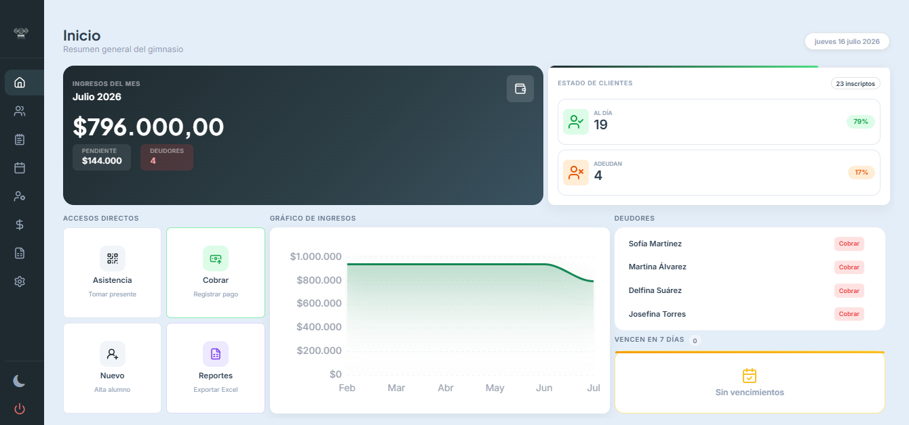
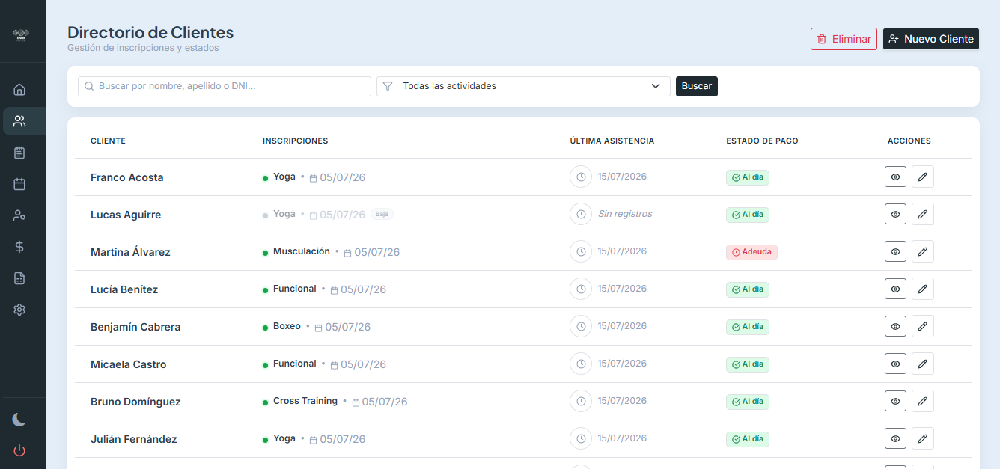
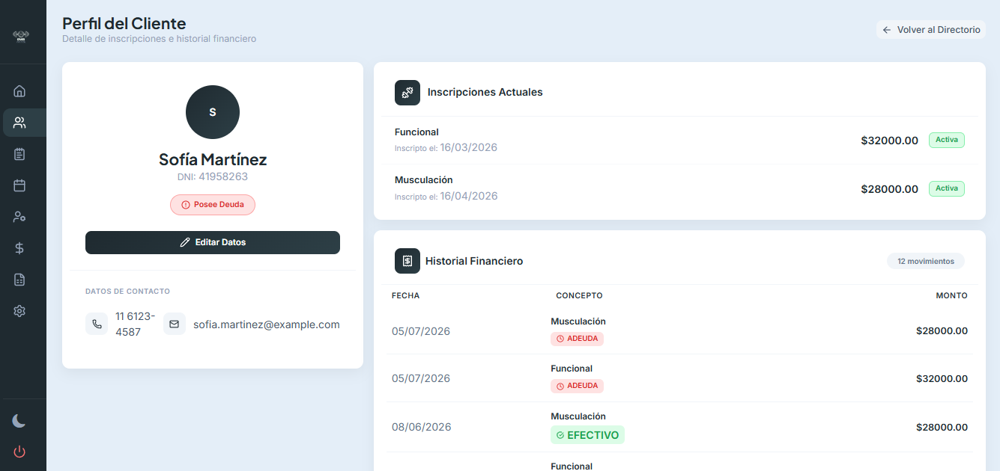
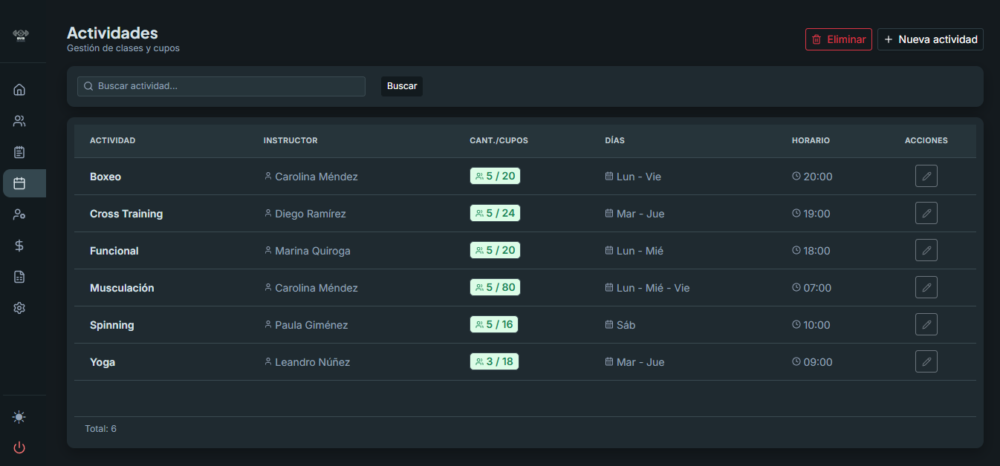
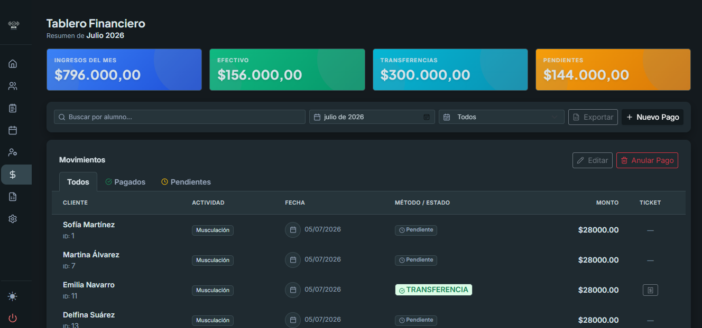
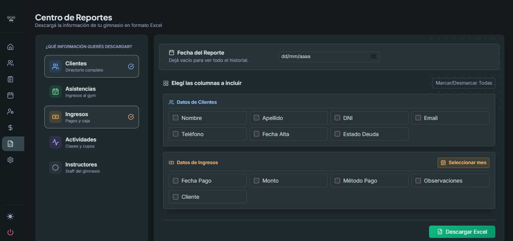

# Gym Manager

Aplicación web para administrar la operación diaria de un gimnasio desde un único lugar. Permite gestionar clientes, actividades, instructores, asistencias, cobros y reportes, con acceso autenticado y soporte para múltiples usuarios.

La interfaz es responsive y cuenta con temas claro y oscuro.

## Funcionalidades

- Dashboard con métricas de ingresos, estado de clientes, deudores y próximos vencimientos.
- Alta, edición, consulta y baja de clientes.
- Inscripción de clientes en una o varias actividades.
- Administración de actividades, horarios, cupos e instructores.
- Registro y consulta de asistencias.
- Gestión de pagos, deudas, recargos y métodos de pago.
- Generación de comprobantes imprimibles.
- Exportación de reportes personalizados a Excel.
- Configuración de los datos del gimnasio y del contenido de los tickets.
- Administración de usuarios con permisos diferenciados.
- Autenticación, control de sesiones y contraseñas cifradas.
- Diseño responsive con modo oscuro persistente.

## Capturas de la aplicación

### Panel principal



### Gestión de clientes



### Perfil e historial del cliente



### Actividades e instructores



### Control de pagos e ingresos



### Reportes y exportación



## Tecnologías

### Backend

- Java 21
- Spring Boot 4
- Spring MVC
- Spring Data JPA
- Spring Security
- Hibernate
- MariaDB
- Apache POI para archivos Excel
- Maven

### Frontend

- Thymeleaf
- HTML, CSS y JavaScript
- Bootstrap 5
- Lucide Icons y Bootstrap Icons
- Chart.js y ApexCharts
- Tom Select

## Requisitos

Antes de ejecutar el proyecto necesitás:

- JDK 21
- MariaDB
- Maven 3.9 o el Maven Wrapper incluido
- Un navegador moderno

Podés comprobar las instalaciones con:

```bash
java -version
mvn -version
```

## Configuración local

### 1. Clonar el repositorio

```bash
git clone https://github.com/1-AlanGonzalez/Organizador.git
cd Organizador
```

### 2. Crear la base de datos

Ingresá a MariaDB y creá la base utilizada por la aplicación:

```sql
CREATE DATABASE GymOrganization
    CHARACTER SET utf8mb4
    COLLATE utf8mb4_unicode_ci;
```

### 3. Configurar las variables de entorno

Copiá `.env.example` como `.env` y reemplazá sus valores con los de tu entorno local:

```dotenv
DB_URL=jdbc:mariadb://localhost:3306/GymOrganization
DB_USERNAME=root
DB_PASSWORD=tu_contraseña_local
APP_ADMIN_PASSWORD=una_contraseña_segura
```

El archivo `.env` está ignorado por Git y nunca debe subirse al repositorio. La aplicación lo importa desde la raíz mediante `spring.config.import`. Las variables del sistema siguen teniendo prioridad, por lo que en producción podés configurar secretos directamente desde el servidor o la plataforma de despliegue.

En PowerShell:

```powershell
$env:DB_URL="jdbc:mariadb://localhost:3306/GymOrganization"
$env:DB_USERNAME="root"
$env:DB_PASSWORD="tu_contraseña_local"
$env:APP_ADMIN_PASSWORD="una_contraseña_segura"
```

### 4. Configurar el administrador inicial

Al iniciar con una base vacía, la aplicación crea un usuario `admin`. Su contraseña se obtiene de `APP_ADMIN_PASSWORD`, que debe estar definida en `.env` o en el entorno antes de iniciar.

Para definirla mediante una variable de entorno en PowerShell:

```powershell
$env:APP_ADMIN_PASSWORD="una-contraseña-segura"
```

En Linux o macOS:

```bash
export APP_ADMIN_PASSWORD="una-contraseña-segura"
```

La variable debe establecerse antes del primer inicio que crea al administrador.

## Ejecución

Con Maven instalado:

```bash
mvn spring-boot:run
```

Con Maven Wrapper en Windows:

```powershell
.\mvnw.cmd spring-boot:run
```

Con Maven Wrapper en Linux o macOS:

```bash
./mvnw spring-boot:run
```

Luego abrí:

```text
http://localhost:8080
```

## Compilación

Para generar el archivo ejecutable:

```bash
mvn clean package
```

El resultado se crea dentro de `target/`. Podés ejecutarlo con:

```bash
java -jar target/gym-manager-0.0.1-SNAPSHOT.jar
```

Para activar el perfil de producción:

```bash
java -jar target/gym-manager-0.0.1-SNAPSHOT.jar --spring.profiles.active=prod
```

Antes de usar ese perfil, configurá la conexión a la base de datos y las credenciales mediante secretos o variables del entorno de despliegue.

## Estructura del proyecto

```text
src/
├── main/
│   ├── java/com/gymmanager/gym_manager/
│   │   ├── config/          # Seguridad y configuración general
│   │   ├── controllers/     # Rutas y manejo de solicitudes
│   │   ├── entity/          # Entidades JPA y DTO
│   │   ├── initializers/    # Datos y configuración inicial
│   │   ├── repository/      # Acceso a MariaDB
│   │   └── services/        # Lógica de negocio y exportaciones
│   └── resources/
│       ├── static/          # CSS, JavaScript e imágenes
│       ├── templates/       # Vistas Thymeleaf
│       ├── application.properties
│       └── application-prod.properties
└── test/                    # Pruebas automatizadas
```

## Módulos principales

| Módulo | Descripción |
| --- | --- |
| Inicio | Métricas y resumen operativo del gimnasio |
| Clientes | Datos personales, inscripciones e historial |
| Actividades | Precios, cupos, horarios e instructores |
| Asistencias | Registro diario de presentes |
| Ingresos | Pagos, deudas, métodos y comprobantes |
| Reportes | Selección de datos y exportación a Excel |
| Configuración | Datos del gimnasio, tickets, pagos y cuenta |
| Usuarios | Administración de accesos para el rol administrador |

## Seguridad

- Las contraseñas se almacenan cifradas con BCrypt.
- Las rutas internas requieren autenticación.
- La administración de usuarios está restringida al rol `ADMIN`.
- Las sesiones expiran después de un período de inactividad.
- Los formularios protegidos utilizan tokens CSRF de Spring Security.

## Datos para una presentación

El proyecto incluye un escenario completamente ficticio para grabar videos o tomar capturas sin exponer datos reales. Crea una base vacía llamada `GymOrganizationDemo`, configura `DEMO_DB_URL` en `.env` y ejecuta:

```powershell
mvn.cmd "-Dtest=DemoDataGenerator" test
```

Luego inicia la aplicación apuntando `DB_URL` a esa misma base. Las credenciales son `demo` / `Demo2026!`. Por seguridad, el generador solo reemplaza el contenido de una base cuyo nombre contenga `GymOrganizationDemo`.

## Estado del proyecto

El proyecto se encuentra en desarrollo activo. Algunas funcionalidades y configuraciones pueden cambiar hasta alcanzar una versión estable.
